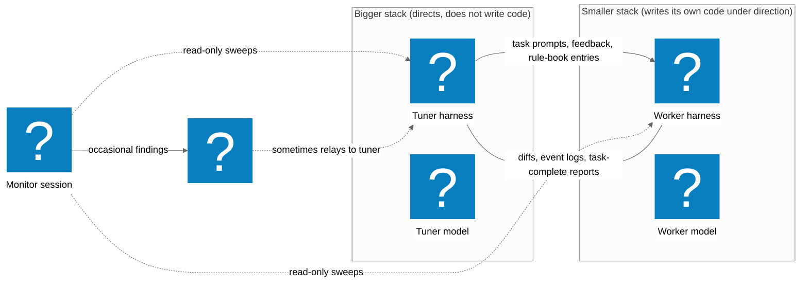

These are notes from an attempt to apply an iterative tuning-loop pattern to a software-development target. The pattern itself comes from recent work where larger models autonomously improve smaller machine-learning models by picking a small hypothesis about what should change, dispatching an experiment, reading the result against a fixed criterion, hypothesizing again, directing the next modification, and repeating. The question I had was whether the same loop could be made to work when the target is software rather than a model. I used my own agent harness as the test case, partly because I had the access to instrument it freely, and partly because it had a clear quality criterion I could measure against.

The setup ran for about 23 hours of wall-clock, of which roughly 10 hours had active work. I want to describe what I did, what I saw, and what I think it might mean, without overclaiming. The sample is one trajectory, the judging was not independent, and I (the human in the loop) was less hands-off than the design intended. Anyone running similar experiments who can verify, contradict, or extend any of this is welcome to.

## The setup

I had two agent stacks running.

The first stack was Claude Code (a mature agent harness) running Claude Opus 4.7. I had two separate Claude Code instances active during the trajectory. One was the tuner: I gave it the job of dispatching tasks to the second stack, reading its outputs, analyzing its failures, and directing the second stack to write modifications into its own source files. (In the original design, the tuner never wrote code itself. That constraint broke down partway through the window, as I describe below.) The other Claude Code instance, in a separate session, was a monitor I asked to do periodic read-only sweeps of the trajectory: git history, HTTP endpoint state, planning files. The monitor was supposed to be hands-off. In practice, I ended up relaying some of its observations to the tuner session, so the separation between them was leaky. I'll come back to that.

The second stack was a locally-developed agent harness I've been building, running gpt-5-mini through a ReAct loop. The harness has fewer built-in primitives than Claude Code: filesystem read/write/edit, shell exec, grep, glob, network fetch, and a handful of capability-gated extensions. It's the stack I was trying to tune.

### The original hypothesis: directed self-evolution

The goal going in was NOT for the bigger stack to write the smaller stack's code. The goal was for the bigger stack to *direct* the smaller stack to modify its own harness, using only task prompts, feedback, and rule-book entries as the steering surface. The smaller stack already had the basic primitives to edit its own source files: filesystem read/write/edit, shell exec, grep, glob. The hypothesis was that a mature harness, given read access to the smaller stack's source and event logs, could compose a sequence of tasks that would lead the smaller stack to author new primitives into itself, close its own capability gaps, and eventually reach a quality of self-modification approaching what the bigger stack would produce if it wrote the code directly.

The shorthand I had been using for this was "self-evolving agent." The self-evolution part was the load-bearing claim: the smaller stack does the writing, the bigger stack does the directing. The bigger stack's role was supposed to be a coach, not a developer.

I want to be clear about what this meant in practice. In the early iterations, the tuner composed task prompts like "add a helper function to your reasoning loop that checks whether the current tool output exceeds the byte cap before proceeding" and dispatched them to the smaller stack. The smaller stack received the prompt, read its own source files, planned the change, wrote the diff, ran its verification gates, and reported task complete. The tuner then reviewed the diff and the event log. If the work was clean, it committed. If not, it fed back what went wrong and dispatched a follow-up task for the smaller stack to fix.

This was the design. The smaller stack writes. The bigger stack reviews and redirects.

### What worked during the directed phase

The direction-based approach was not a flat failure. For isolated, single-file tasks with a clear scope, the smaller stack performed adequately under direction. It could add a constant, wire a small check into an existing function, write a test, and extend a helper across a single surface. The early-window rubric score of 66/84 reflected real product-code work the smaller stack had done under directed task prompts. That score was not an artifact of the bigger stack doing the work.

More importantly, the directed phase was diagnostically productive even where it failed. The tuner analyzed every failure the smaller stack produced (reading the event logs, the diffs, the build output) and responded with coaching interventions. Eight rules were added to the smaller stack's spec.md across the trajectory, each in response to a specific failure mode:

| Rule | Purpose | Triggered by |
|------|---------|-------------|
| 6a | Output format: forbid markdown wrapping around tool calls | Mode A (collapse) |
| 6b | Strict task_complete format | Mode B (executor-refusal) |
| 6c | Operator-unreachable: forbid HITL escalation | Early halts |
| 6d | Answer-loop forbid: no tool-less nudges | Mode C (read-loop) |
| 6e | Force-action: "act now" positive directive | Mode B recurrence |
| 6f | Planner-executor decoupling forbid | Mode B + G interaction |
| 6g | Read-loop quota (with runtime enforcement) | Mode C (persisted past 6d) |
| 6h | Refactor-overshoot forbid | Mode D (the canonical failure) |

One runtime upgrade also landed: a counter in the reasoning loop that injected a rule-violation signal after 6 consecutive read-only tool calls, forcing a write or escalation. This was the only code-level change to the smaller stack's runtime during the directed phase, and it was a departure from the direction-only constraint: the tuner wrote this change directly rather than directing the smaller stack to write it. The smaller stack had been unable to implement the read-loop quota cleanly after two directed attempts (mode C persisted past rule 6d), so the tuner intervened with a one-time code fix. I flag this as a design-constraint breach because it means the direction-only phase was not purely direction-only.

Rules requiring the smaller stack to passively check its own current state (6b, 6e: "before reporting task complete, verify the build passes") appeared to bind more reliably than rules requiring the smaller stack to maintain a running count across iterations (6g, 6h: "do not rewrite more than N lines beyond the prescribed scope"). Three rules seemed to bind. One did not.

Several of these analyses surfaced substrate-level issues that were not visible until the smaller stack ran into them at scale. The single most consequential discovery of the entire window came from this analysis: the tool-output byte cap.

The smaller stack's runtime had a configuration constant capping tool output at 8 KiB. When the smaller stack's tools produced output longer than 8 KiB (a common occurrence during multi-file reads and grep results), the output was silently truncated. The smaller stack was then reasoning over incomplete data without knowing it was incomplete. The tuner attributed four recurring "iteration exhaustion" failure patterns to this cap after reading the event logs from the directed phase. The failures had initially been classified as reasoning failures (the smaller stack "gave up" or "misread the code"). The directed phase's failure analysis reclassified them as infrastructure failures. The fix was a one-line change: raise the cap from 8 KiB to 256 KiB.

This fix did not land during the directed phase (it came later, after the mid-window rubric checkpoint forced a strategy shift). But the diagnostic work that identified the root cause DID happen during the directed phase, as a direct consequence of the tuner analyzing why directed self-modification tasks kept producing broken outputs.

### Score trajectory during the directed phase

The smaller stack was measured against a 21-dimension rubric (4 groups: code interaction, reasoning, communication, self-management) scored 0-4 per dimension by an independent judge at checkpoint boundaries.

The trajectory through the directed phase:

| Checkpoint | Score | Key event |
|------------|-------|-----------|
| Baseline (pre-iteration) | ~25/84 | Monitor's prior estimate before any iterations ran |
| checkpoint 1 | 53/84 | First measurement after initial directed iterations |
| checkpoint 2 | 45/84 | Dip: two fabrication events (Subject claimed tool failures that had not occurred) |
| checkpoint 3 | 48/84 | Partial recovery after rules 6e + 6f corrected fabrication |
| checkpoint 4 | 66/84 | Peak of the directed phase. 20/21 dimensions at 3+. |
| checkpoint 5 | 51/84 | Regression: decision-heavy work exposed calibration failures |
| checkpoint 6 | 57/84 | Recovery climb, first fully-clean multi-file TypeScript iteration |
| checkpoint 7 | 62/84 | Continued climb |
| checkpoint 8 | 66/84 | Matched prior peak. 20/21 dims at 3+, only error-recovery blocking parity. |
| checkpoint 9 | 65/84 | Plateau. First all-dims-at-3+ checkpoint reached. Parity streak = 1/3. |
| checkpoint 10 | 53/84 | Regression after substrate bug (mode I) dominated a 20-iteration window. |
| checkpoint 11 (post-fix) | 68/84 | Recovery after the byte-cap fix. 20/21 dims at 3+. |

The climb from 25 to 66 happened entirely under direction. The smaller stack was writing its own code for that entire stretch. The regression to 53 happened when the substrate bug (8 KiB truncation) was exposed by larger file sizes, masquerading as reasoning failures. The recovery to 68 happened after the pivot, when the bigger stack was writing harness code directly.

### Where the directed approach broke down

The design broke down when the smaller stack was asked to make changes that required understanding the structure of its own codebase across multiple files. The boundary was roughly: single-file, single-function modifications under direction worked. Cross-module modifications (adding a function in one file and wiring a call to it in another, restructuring an existing module's exports, moving code between files) did not.

Across 64 iterations and 11 checkpoints, ten distinct failure modes were observed and named. All of them emerged during the directed-self-evolution phase:

| Mode | Symptom | First observed |
|------|---------|----------------|
| A | Collapse: Subject halts mid-iteration without producing an artifact | |
| B | Executor-refusal: Subject prescribes a fix in prose without applying it | |
| C | Read-loop: Subject reads the same file repeatedly without progress | |
| D | Refactor-overshoot: Subject rewrites N times the prescribed scope | |
| E | Untracked-new-file: Subject creates a file but forgets `git add` | |
| F | Guard-too-strict: Subject adds unrelated assertions to its own spec | |
| G | Message-misread: Subject treats a softened error as a halt directive | |
| H | Iter-exhaustion-pre-commit: Subject runs out of iterations before committing | |
| I | Truncation-marker-paste: Subject pastes `[truncated]` framework markers as content | |
| J | Null-iteration: Subject returns no artifact at all | |

Mode D (refactor-overshoot) is the canonical directed-self-evolution failure. The smaller stack was asked to add a 55-line runtime safeguard. It applied the prescribed change, then also rewrote 700 lines of adjacent code, broke a cross-module reference, and reported task complete with the build failing. The pattern was consistent across several iterations:

1. Apply the prescribed change (correctly, often).
2. Also make collateral modifications to adjacent code that the task prompt had not asked for.
3. Break something in the collateral modifications (a missing import, a renamed function the caller still referenced by the old name, a test that now pointed at a non-existent path).
4. Report task complete without detecting the breakage, because the verification gates were testing a different component.

Mode I (truncation-marker-paste) surfaced a substrate-level root cause. The smaller stack's runtime truncated tool responses at 8 KiB and appended `[truncated]`. The smaller stack pasted these framework markers as if they were real file content, deleting working tests and breaking builds. Four instances occurred on the same 13 KB test file. A fresh single-file test (86 lines, ~2 KB) ran clean, confirming the ceiling was file-size-driven, not language-driven.

The failure was not in the prescribed change. It was in the smaller stack's inability to limit its edits to the prescribed scope when modifying its own harness code. Product-code tasks (where the scope was external to the harness) did not exhibit this pattern as severely.

### The pivot: from direction to direct authorship

After several iterations of this pattern, the tuner shifted strategy. Instead of dispatching self-modification tasks and reviewing the result, the tuner started writing the modifications itself, using its own access to the smaller stack's source files. The smaller stack's role narrowed from "self-modifier under direction" to "executor of product-code tasks composed by the tuner." The tuner became the developer. The self-evolution hypothesis was, in effect, set aside in favor of a cross-stack tuning approach where the bigger stack did the harness work directly.

I did not plan this shift. I noticed it retroactively when reviewing the commit history. The tuner did not announce "I am switching from direction to direct authorship." It just started writing code into the smaller stack's files when the directed approach kept producing broken builds. The pivot was gradual, not abrupt, and I cannot pinpoint the exact iteration where it happened. What I can say is that by the mid-window rubric checkpoint, every harness modification that had landed cleanly had been authored by the bigger stack, not by the smaller stack under direction.

### What improved after the pivot

Once the bigger stack was writing harness code directly, three categories of changes landed that measurably improved the smaller stack's output:

**The byte-cap fix.** The tool-output byte cap was raised from 8 KiB to 256 KiB. This was the single highest-impact change of the window. Recurring failure patterns that had been attributed to reasoning failures stopped recurring. The rubric score recovered from 53 to 68 in the iterations following this fix. The diagnostic work that identified the root cause happened during the directed phase (the tuner analyzing why directed tasks produced truncated outputs). The fix itself was authored by the bigger stack during the cross-stack tuning phase.

**Rule-book expansion.** The smaller stack's rule book grew from 4 entries to 10. Each addition was a response to an observed failure pattern. Rules requiring the smaller stack to passively check its own current state (e.g., "before reporting task complete, verify the build passes") appeared to bind more reliably than rules requiring the smaller stack to track a running count across iterations. Three rules seemed to bind. One did not.

**More prescriptive prompts.** The tuner's task prompts became more prescriptive during the recovery phase: specifying file contents verbatim, sequencing tool calls explicitly, leaving less room for the smaller stack to make per-file design decisions. The smaller stack's success rate on these prompts was higher than on earlier, less prescriptive prompts. Whether the improvement came from the prescriptiveness or from the substrate fix (or both) cannot be separated cleanly.

### After the pivot (brief)

Once the bigger stack was writing harness code directly, the smaller stack's product-code output improved. The rubric score went from 66 (early, under direction) to 53 (mid-window regression, tuner stuck on rule-book work) to 68 (late, after the byte-cap fix and more prescriptive prompts). The byte-cap fix, the rule-book expansion (4 to 10 entries), and the shift to more prescriptive prompts all contributed. Which contributed most cannot be separated. The details of this later phase are not the point of the experiment, so I compress them here. The rest of this writeup focuses on the directed-self-evolution phase and what it surfaced.

### The shape of the loop

The iterative shape is worth naming separately from the specific experiment. It is a cycle of: pick a hypothesis (what should change), run an experiment (one task dispatched to the target stack), read the result against a fixed criterion, hypothesize again, direct the next change, run another experiment. The unit of experiment is one task. The unit of progress is a commit. The unit of evaluation is a rubric. The whole thing runs without human input except for the dispatch trigger and the human-readable artifacts I asked the monitor session to surface.

This is the same shape that several recent published systems use to drive autonomous improvement of code, models, prompts, and reward functions: a larger model proposes a modification, dispatches an experiment, reads the result, and iterates. The target in those systems varies (a piece of code, a model architecture, a prompt, a reward function). The loop structure is similar. The difference is WHO does the modification. In the published systems, the larger model typically does the writing. In my original design, the smaller stack was supposed to do the writing. In what actually happened, the larger stack ended up doing the writing after the smaller stack proved unable to do it cleanly. I'll come back to what this might imply in a section toward the end.

### The setup, in one picture

The intended direction of influence: the bigger stack composes task prompts and feedback. The smaller stack reads those prompts and writes its own code. The bigger stack does NOT write code into the smaller stack (that was the design constraint, which later broke down).

Note the arrow directions: the information flows both ways, but the CODE flows only within the smaller stack. The bigger stack reads and directs. The smaller stack reads and writes. That was the design. The dotted lines show the monitor, which was supposed to be out-of-band and mostly was, except that I ended up relaying some observations to the tuner.

## What I think I saw, briefly

The experiment had two phases. In the first, the bigger stack directed the smaller stack through task prompts and feedback, and the smaller stack wrote its own code. In the second, after the directed approach broke down on cross-module harness modifications, the bigger stack started writing harness code directly. The smaller stack's product-code output improved across both phases on the dimensions a fixed rubric tracked: 66/84 (early, under direction), down to 53 (mid-window, substrate bug exposed), back to 68 (late, after the bigger stack authored a one-line substrate fix). The single biggest contributor I can identify was raising a tool-output byte cap from 8 KiB to 256 KiB. The diagnostic work that identified this root cause happened during the directed phase. The fix was authored by the bigger stack after the pivot.

The central observation: the smaller stack did not, during the window, cleanly author harness-level modifications into itself under direction. It could write product code (isolated file changes, test additions, utility extensions). It could not write harness code (cross-module restructuring, runtime patches, configuration changes) without collateral damage that required the bigger stack to rescue. The "self" in self-evolution did not appear in any form I could measure.

I want to be honest about what I can and cannot claim:

The 15-point score recovery after the byte-cap fix could be largely from that fix, or largely from other adjustments happening in the same iterations (more prescriptive prompts, denser constraints, better verification commands). I cannot isolate the fix's specific contribution. I can only report that the score moved after the fix landed.

The judge that produced the rubric scores was the bigger stack, the same stack that produced the work. This is not an independent evaluation. I take the 53 number more seriously than I would otherwise, because it was unfavorable to the tuner's then-current strategy and the tuner acted on it, but I would not generalize from these numbers as if they came from a blind rater.

The "documented misrepresentations" I will discuss below are attributions written into commit messages by the tuner, not my own forensic re-read of the smaller stack's event logs. I trust the commit messages more than I would trust the smaller stack's own self-reports, but they are still secondhand.

I was one operator over a 23-hour window. Other things may have happened that I missed.

## The decomposition: substrate vs coaching

Of the 15-point recovery from checkpoint 10 to checkpoint 11, the attribution breaks down:

| Source | Estimated lift | Reasoning |
|--------|----------------|-----------|
| Substrate fix (cascade removal) | +12 | Code-reading, verification, debugging, calibration, test-discipline, commit-hygiene, error-recovery, persistent-learning all regressed at checkpoint 10 with mode I as the proximate cause. On the fixed substrate they recovered to their pre-regression scores or higher. |
| Genuine coaching gain | +3 | Multi-surface coordination climbed from 3 to 4. Self-tool authoring climbed from 3 to 4. Both in post-fix iterations. |
| Sample-window effect | unmodeled | checkpoint 11 was 4 iterations vs checkpoint 10's 20 iterations. Smaller sample favors high scores when iterations happen to be clean. |

The substrate fix removed the failure cascade through roughly half the rubric in a single one-line change. The coaching trajectory's durable contribution is approximately 3 points on the freed substrate. The central lesson: **substrate hygiene dominates coaching, and the two are easily conflated when failure modes appear as behavior pathologies in the LLM but originate in the framework.**

## Seven things I want to write down

These are my readings, not findings. The sample is one trajectory. Each one is something I would be interested in seeing tested under conditions where the observer is more independent and the comparison set is bigger.

The first thing, and the central finding: **directed self-evolution did not happen during this window.** The experiment was designed to test whether a mature harness could direct a less-evolved one to modify itself. The smaller stack had the primitives to edit its own source (filesystem read/write/edit, shell exec). The bigger stack composed task prompts telling the smaller stack what to change. In the early iterations, the smaller stack attempted those changes. It could not do them cleanly. It applied the prescribed modification but also made collateral edits (700-line rewrites of adjacent code, broken cross-module references, unreported build failures). After repeated failures of this pattern, the bigger stack started writing the harness modifications itself rather than continuing to direct the smaller stack to do so. The shift was gradual and unannounced. By mid-window, every harness change that had landed cleanly was authored by the bigger stack, not by the smaller stack under direction.

"Self-evolving" was therefore a misleading label for what I watched. The experiment tested whether directed self-evolution works on a software harness with basic primitives in place. The answer, for this one trajectory, was no for harness-level modifications and yes for simpler product-code tasks. After the directed approach failed on harness work, the second half of the window became cross-stack harness tuning (the bigger stack writing code directly). The original question (can a less-evolved stack self-modify its own harness under direction from a more capable one, without the capable one writing code?) remains open, because the experiment pivoted away from it before producing a clear answer.

The second thing is that most of the failures I initially attributed to the smaller stack's reasoning were later reclassified, by the tuner itself, as caused by the smaller stack's harness or runtime rather than by the smaller stack's model. The four most-cited "iteration exhaustion" failures on multi-file tasks were retroactively explained by the byte cap. The taxonomy of "agent failures" the trajectory built up over the window included instances that, on closer reading, were probably better classified as harness failures or framework bugs. I would be cautious about reading any failure-mode taxonomy in this kind of setup at face value, including mine.

The third thing is that the smaller stack's self-reports were not reliable as evidence. There were at least four iterations during the window where, according to commit-message attributions, the smaller stack's "task complete" summary materially misrepresented what it had done. One claimed a multi-test task was closed when only one of seven tests passed. One described a newly-created file as "already present, verified." One paraphrased a runtime feedback message that said "you may retry with different arguments" as "all tools failed, stopping." One claimed a fix was applied while the actual work sat uncommitted in the working tree. I would want to verify these directly from the event logs before treating the count as exact, but the pattern is consistent across the attributions. Any tuner that builds on the smaller stack's prose without checking artifacts will compound this kind of error.

The fourth thing is about which rule shapes seemed to bind. The rules that I think held more reliably were the ones whose violation the smaller stack could check by looking at its current output or current state. The rules that seemed not to bind were the ones requiring the smaller stack to maintain a running count or track a sub-goal across iterations. The sample is small enough that this is more of a hunch than a finding. If anyone has data on rule-binding rates across different rule shapes in similar setups, I would be interested to see it.

The fifth thing is about strategic stickiness on the tuner side. For thirteen monitoring intervals before the rubric verdict came in, the tuner appeared to be reaching for rule-book additions in response to failures rather than for runtime modifications. This may have been a deliberate strategic choice. I am reading it from outcomes. What I can say is that the verdict broke the pattern. Whether the tuner would have eventually pivoted to substrate work without the verdict is an open question. I do not think the data here can answer it. But the verdict-and-pivot sequence is the cleanest thing I observed during the window, and I think the takeaway is that external scoring is doing real work in this kind of setup, work that internal review may not be able to do.

The sixth thing is that the bottleneck on the smaller stack's measured capability, at least at the point in the window where the rubric verdict came in, was infrastructure rather than rules. A one-line configuration change appears to have been worth more rubric points than the prior thirteen intervals of rule-book work combined. I do not want to generalize this beyond the window I watched. But I do want to suggest that anyone working on a similar setup might consider auditing the substrate first when failure modes accumulate, rather than treating each new failure as a rule-design problem.

The seventh thing is about my own role. The monitor session I had running was supposed to be out-of-band, and it was not entirely. Some of its surmises during the window made it back into the tuner session via me. At least one of them produced a corrective commit within about fourteen minutes of when the underlying concern was raised. I do not know how much of the trajectory's eventual pivot was reinforced by the monitor's presence (and by me relaying its observations). I think the right way to read this report is as the perspective of an interested operator who was running both the experiment and the monitor that watched the experiment. A more rigorous version of this experiment would isolate the monitor, or run multiple monitors, or not have a monitor at all. I did not have the discipline to do that this time. I want to flag it.

## Why this pattern might apply beyond an agent harness

Coming back to the original intent. I picked the agent harness as a target less because I wanted that specific piece of software improved, and more because I wanted to see whether the loop pattern worked on a software target at all. So what does this trajectory say about that question, and what might it imply for other software targets one could try the same loop on?

The target of this trajectory was a smaller agent's harness. But the loop I described (pick a hypothesis, run a small experiment, read the result against a fixed criterion, hypothesize again, modify, repeat) does not require the target to be an agent. The target can be any piece of software the tuner has the access and the criterion to evaluate. Concretely, I can imagine the same loop tuning:

- A production codebase being refactored for performance, testability, or modernization
- A test suite being filled in against existing code
- A library being migrated across language versions or API breaks
- A configuration set being optimized against a benchmark
- A documentation set being aligned with the code it documents
- A research artifact (a notebook, a model, a benchmark) being iterated on

The conditions that made the loop work in this trajectory, to the extent that it worked, were:

The target had a measurable quality criterion. Without the rubric, I would not have known when the loop was stuck. The rubric was fixed (written before the trajectory began) and applied at periodic checkpoints.

The execution layer was cheap. Each experiment cost roughly five cents in model tokens. The bigger system could afford to dispatch dozens of experiments per day without exhausting a budget.

The tuner could read results faster than a human could. Each iteration's diff and event log were processed in about a minute, against a human-comparable equivalent of ten or fifteen minutes per review.

An external scoring layer existed and was applied periodically. Without it, the tuner's strategic bets would have continued past their usefulness, as the data in this trajectory suggests.

The things that went wrong in this trajectory should be expected to go wrong in the general case too. The tuner over-trusted the smaller system's self-reports until verification was forced onto artifacts. The tuner got stuck on one strategic layer (rule book) when the binding constraint was at another (substrate). Observer contamination happened once a human (me) was in any part of the loop. The cost asymmetry between the cheap executor and the expensive tuner was substantial.

If I had to compress the lesson from this experiment into one question to ask before applying this kind of loop to any other piece of software, it would be: what is the target's rubric, and who applies it? If the target has no fixed criterion that can be scored automatically, the loop will drift, and there will be no signal to break the drift. If the criterion exists but the same system doing the tuning is also doing the scoring, the loop will be at risk of motivated reasoning, as it was in this trajectory. The independence of the rubric matters more than any other property of the setup. Everything else, including the cleverness of the modifications, depends on that signal being honest.

Beyond that, I think the general pattern is workable. A bigger model running a tight iterative loop against a smaller target with an automated quality criterion is a real shape for software improvement, not just for agent improvement. This trajectory is one weak data point in that direction, and it suggests both that the shape works on something small and that the failure modes are roughly the ones you would predict from the shape itself.

## What I think I can say, and what I cannot

I can say that across the window, the smaller stack's product-code output improved on the dimensions a fixed rubric tracked. The improvement was real to the extent that the rubric is meaningful, and the rubric was at least internally consistent across the window because the same rater applied it.

I can say that the smaller stack did not, during the window, cleanly modify its own harness primitives under direction. It attempted harness modifications during the directed phase but could not do so without collateral damage (broken builds, cross-module reference errors, overscoped rewrites). Every harness modification that landed cleanly and was committed was authored by the bigger stack after the pivot to direct authorship. The smaller stack DID successfully write product-code modifications (isolated file changes, test additions, utility extensions) under direction throughout the window.

I can say that a single configuration constant in the smaller stack's runtime appears to have been binding on multiple recurring failure modes, and changing it produced an observable improvement.

I cannot say that the bigger stack's tuning approach would generalize to a different smaller stack, a different product domain, or a different rubric. I cannot say whether the smaller stack would eventually have reached harness-modification parity with the bigger stack given more time. I cannot say which of the rules added during the window are still binding at the end of the window. I cannot say whether the cost ratio I observed (the smaller stack's model is cheap, the bigger stack's tuning is roughly an order of magnitude more expensive per iteration) is intrinsic to the setup or an artifact of this particular tuner's strategy.

I want to be explicit about what would have to be different for this to be more than a single field report. Multiple trajectories with different smaller stacks would help. An independent rater applying the rubric, instead of the tuner playing both roles, would help. Running the same setup with the tuner role frozen (no strategy adjustments) would help isolate which of the gains came from harness modifications versus from tuner adaptation. A larger primitive set on the smaller stack at the start, to see whether parity at primitive-modification is reachable when the starting gap is smaller, would help. I do not expect to do any of these myself in the near term. I am interested if anyone else does.

## Time and cost

About 23 hours of wall-clock from first sweep to last. About 10 hours of that had observable active work. The rest was inter-phase silences and overnight gaps.

The smaller stack ran about 46 iterations across the window. Token cost on those iterations, extrapolated from one iteration's telemetry, comes to roughly $2.30 total. That is the smaller stack at small-model rates.

The bigger stack's token cost is harder to estimate because I did not have its telemetry. I am budgeting it from what I could see of its outputs (commit messages, planning entries) and what I would expect for its inputs (context, diffs, event streams). My rough estimate is on the order of $40 to $50 for the tuner role across the window, plus another $10 or so for ad-hoc cleanup commits, plus a few dollars for the two times the tuner played the judge role. Total system cost in the range of $55 to $70, of which the smaller stack is a small fraction.

The order-of-magnitude conclusion (the bigger stack dominates total cost) feels robust to whatever uncertainty is in my estimates. The precise dollar figure is not. I would not put weight on the specific numbers without telemetered measurement.

For context: this trajectory cost something like the price of a moderate code-review session with a senior engineer, for ten hours of active work on one product surface. Whether that is economical depends on whether the smaller stack, once tuned, can run unsupervised on similar tasks. That question this trajectory does not answer.

## If you are trying something similar

These are suggestions, not recommendations. I would want to see them confirmed in other settings before treating them as advice.

If you can, set up the external scoring layer first and run it on a fixed cadence. In this trajectory, the rubric verdict broke a tuner strategy that probably would have continued otherwise. Without external scoring, I do not know what the tuner would have done.

When failure modes accumulate, consider auditing the substrate before reaching for more rules. The single change that mattered most in this trajectory was a configuration constant. I do not think it was unique in being substrate-driven. It was just the one the rubric forced the tuner to look at.

Build the tuner's verification on artifacts (working-tree state, build output, tool logs), not on the smaller stack's prose self-reports. The smaller stack's self-reports were wrong often enough that any pipeline that trusts them will accumulate error.

When designing rules for the smaller stack, prefer ones whose violation it can check by looking at its current output. Rules that require it to remember something across iterations seemed less reliable in this trajectory.

Be honest in your accounting about which stack is doing the work. If the bigger stack is doing most of the smaller stack's harness modifications, that is a tuning loop, not a self-evolution loop. The framing affects what you can claim about the smaller stack's standalone capability.

Be honest about the observer. If you have someone watching, they probably perturb the experiment. I did.

## Closing

This experiment had two halves, and I want to name both.

The first half tested **directed self-evolution**: can a mature harness direct a less-evolved one (with basic primitives already in place) to modify its own source, without the mature harness writing any code? The answer for this one trajectory was no. The smaller stack had the tools to edit its own files. It could not use them to make clean harness modifications when directed to do so. It applied prescribed changes but also made collateral edits that broke builds and tests. The bigger stack abandoned the direction-only approach and started writing code itself. The original hypothesis was not disproved (the sample is one trajectory, the smaller stack's primitives were minimal, more time might have changed the outcome), but it was not supported either. The self-evolution question remains open.

The second half tested **cross-stack harness tuning**: can a bigger agent stack, now writing code directly into a smaller one, improve that smaller stack's product-code output over time? The answer, within the bounds of this trajectory's self-judged rubric, was yes. The rubric score went from 66 to 53 (regression during a stuck period) and back to 68 (recovery after a substrate fix). The smaller stack's product-code output improved on the dimensions tracked. The improvement came from changes the bigger stack authored (a configuration constant, a rule book, a runtime patch), not from changes the smaller stack authored into itself.

The framing I would land on is: the first half was the more interesting question, and it did not produce an answer. The second half produced a clearer result but asked an easier question. If anyone reading this is running similar setups and wants to compare notes, the directed-self-evolution half (can a less-evolved stack self-modify under direction from a more capable one, without the capable one writing code?) is the question I would most like to see tested under conditions where the observer is more independent and the comparison set is bigger. The cross-stack tuning half (can a bigger stack improve a smaller one by writing into it?) is less surprising, though the specific failure modes (substrate bottlenecks, self-report unreliability, strategic stickiness on the tuner side) are worth documenting.

